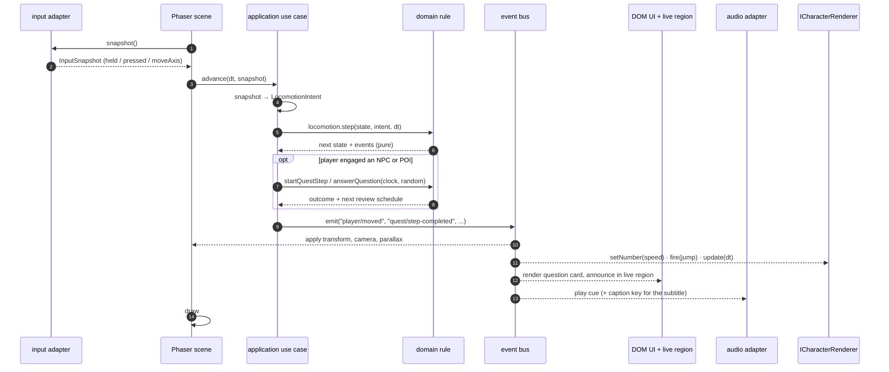
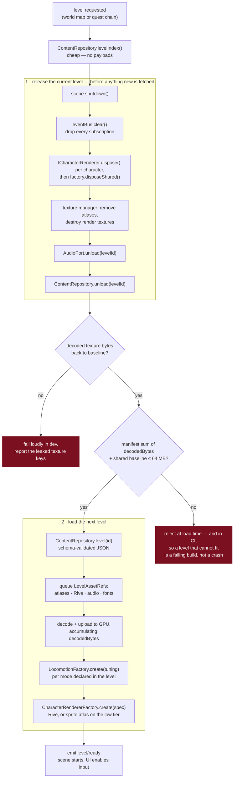
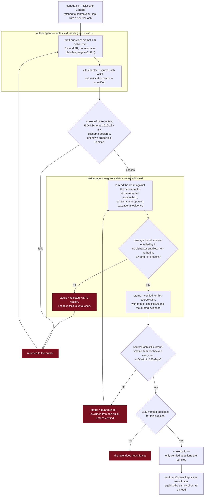

# TrueNorth — architecture

The shape of the system, and why it is that shape. Decisions live in `docs/adr/`; this file shows how
they fit together. If a diagram and an ADR disagree, the ADR wins and this file is the bug.

One sentence: **the engine changes more often than the rules, so the rules do not know the engine exists.**

Every boundary in this file is defended by something that fails a build, never by a convention: layering by
`.dependency-cruiser.cjs`, content shapes and value constraints by `make validate-content`, the agreement
between a schema and its port type — names, optionality *and* value types, branded ids included — by the
ADR-0007 contract test, unimplemented ports by the `PROVISIONAL` contract test, and dated commitments in
documents by the ADR-0009 obligation gate. If a rule here has no gate behind it, that is stated where the
rule is.

## 1. Layers

`app/domain` is entities and pure rules. `app/application` is use cases and ports — interfaces only.
`app/adapters/*` implement those ports, one technology per directory. `app/ui` is accessible DOM.
`app/bootstrap` is the only place a concrete is chosen. `common/` is a leaf both sides may use.

Imports point inward. Facts travel outward on the typed event bus. Nothing points sideways:
adapters never import each other, and the UI never imports an adapter.

`.dependency-cruiser.cjs` is this picture, written as twelve rules, run by `make lint`. Every rule carries a
`comment` saying which boundary it defends. A violation fails CI; there are no warnings. Ten rules constrain
what a layer may import; two, added by amendment to ADR-0005, constrain who may import *it* —
`app/adapters` and `app/ui` may take the id vocabulary from `app/domain/ids` and nothing else from the
domain, and an adapter may not import `app/application/use-cases`, because an adapter is driven and never
driving.

## 2. A frame

The scene owns rendering and nothing else. It samples intent, asks the application to advance the world,
and applies what comes back. The domain decides; the bus announces; the renderers react.

The DOM UI and the Phaser canvas receive the *same* facts. That is what keeps the live region honest:
if the canvas shows it, the announcement was published, so the live region has it too.

Three consequences worth stating plainly:

- The domain takes `Clock` and `RandomSource` as arguments. It never reads `Date.now()` or `Math.random()`,
  so an exam draw is replayable from its seed and a spaced-repetition test does not need to freeze time.
- `Locomotion.step` is pure. Adding canoe, skate, bike, train, horse, skateboard or dogsled is one strategy
  plus level JSON — the scene above does not change, because it never learns the mode.
- Nothing in this sequence is Phaser-specific except the two boxes labelled Phaser.

## 3. Level load and unload

The budget is the design driver: **≤ 64 MB decoded texture memory per level on iPhone, and the previous
level is released before the next one is loaded** (CLAUDE.md, Budgets). So unload is not cleanup after
the fact — it is a step the next load waits for.

The loader admits a level only if the manifest's declared `decodedBytes` fit the ceiling. That check is
static and runs in CI too, so a level that cannot fit is a failing build, not a crash on a phone.

**ADR-0013 is the decision behind this section** and should be read with it. Three things it settles that the
diagram cannot show: full-screen parallax layers ship at **1× only** (the same art at 2× puts Ottawa 46 % over
the global ceiling on payload of 0.19 MiB, so no download gate would ever have flinched); "full-screen" means
"the key appears in some level document's `layers[]`", not a pixel-area threshold; and the 64 MiB figure is a
**floor** on VRAM rather than a ceiling, because mipmaps, render targets and Rive's canvas surfaces are sized
by the display and not by a file, so no file-measuring gate can count them. The gap between 64 MiB and the
hardware limit is where those live.

The `+ shared baseline` term in the BUDGET node below is design intent that no gate implements yet — see
ADR-0013's open obligation.

`ContentRepository.unload`, `AudioPort.unload` and `CharacterRendererFactory.disposeShared` exist only
because of this diagram. They are on the ports so that no scene has to remember to call them.

## 4. Content pipeline

Facts are paraphrased from *Discover Canada* on canada.ca, chapter-referenced, and verified before they
ship (ADR-0003). The load-bearing rule is a **separation of duties**: the author writes the question and
may never set its verification status; the verifier grants or refuses status and may never edit the text.
A single agent doing both would be marking its own homework, and the status would mean nothing.

Status is granted against a `sourceHash`. If canada.ca changes, the hash changes, the status no longer
matches, and the question falls out of the build — automatically, without anyone noticing the edit.

The verifier writes five fields and only five (ADR-0003, mirrored by `FactVerification` in
`app/application/ports/content-repository.ts`): `status`, `model`, `checkedAt`, `sourceHash` and
`evidence`. `evidence` is the passage from the cited section quoted exactly, and it is the field that makes
ADR-0003's "the bank is auditable" consequence true — a `verified` status with no quoted passage is an
assertion, not an audit trail. An earlier draft of the port dropped it; nothing may drop it again, and since
slice 1 nothing can: `common.schema.json#/$defs/factVerification` carries a conditional requiring a non-empty
`evidence`, a non-empty `model`, a non-null `checkedAt` and a full `sourceHash` whenever `status` is
`verified`, so the claim fails `make validate-content` before `verify-content` is reached.

The pipeline below is drawn around a question because a question is the commonest case, but ADR-0003's
second amendment made the subject the **claim**, not the screen. A landmark blurb and a line of NPC dialogue
carry a `FactClaim` — `factual`, plus the same `source` and `verification` blocks — and travel the same
path. A wrong fact in a Mountie's mouth is exactly as wrong as one on a question card.

Indigenous content passes `docs/content-review.md` as well: name the nation depicted, no invented patterns,
no sacred items as props, no caricature, identical cartoon proportions for every character.

## 5. Ports

All under `app/application/ports/`, re-exported from `index.ts`. Interfaces and types only.

`PROVISIONAL` in the last column means nothing imports the port and nothing implements it: it is a design
sketch that happens to be type-checked, and the first implementer may change it without an ADR (ADR-0008).
The column is enforced, not maintained by hand — `tests/unit/contracts/ports-are-provisional.test.ts` fails
if a port is unconsumed and unmarked, and fails again if the marker outlives the first caller. **It also
reads this table**: a row whose State disagrees with its file's marker fails the same test, so the table
cannot drift out of step with the directory it describes. That drift had already happened once — four rows
here still read `PROVISIONAL` after their first callers landed in slice 1.

The gate reads import edges, so the finest thing it can see is a file. A *member* with no caller is
ADR-0015's subject and is found by review, not by CI; the reasoning for not building a member-level checker
is recorded there.

| Port | Hides | Notes | State |
|---|---|---|---|
| `ContentRepository` | fetch, ajv, caching | Async, `Result`-returning; `unload` serves the texture budget (ADR-0013) | Consumed |
| `ProgressRepository` | `localStorage`, quota, private mode | `ok(null)` means "no save", not "storage failed" | Consumed |
| `SaveCodec` | the export/import format | `decode` validates and migrates; never trusts its input. Migration is a mechanism with no steps — ADR-0015 | Consumed |
| `Clock` | `Date.now`, `performance.now` | `now()` for scheduling, `elapsed()` monotonic for timers. **No `nowIso()`** — ADR-0015 removed it; `toIsoInstant(clock.now())` is the one conversion | Consumed |
| `RandomSource` | `Math.random` | Seeded variant makes an exam draw replayable | Consumed |
| `Locomotion` | how a mode moves | Pure `step`; implementations live in the domain | Consumed |
| `ICharacterRenderer` | Rive vs. sprite atlas | Identical artboard, input, slot and expression names in both — and identical *structurally*: both backends answer `skinSlots`/`skinOptions` out of `CharacterRendererSpec.slots`, one array from one character document | Consumed by `app/adapters/rive` and `app/adapters/phaser/sprite-character-renderer.ts` (slice 1 task 1.12) |
| `AudioPort` | howler, autoplay unlock | Every cue carries a `captionKey` — sound always has a visual twin | `PROVISIONAL`, **no task** — delete it if slice 2 closes without an audio adapter |
| `LocalizerPort` | i18next | No literal player-facing string exists anywhere else | `PROVISIONAL` → slice 1 task 1.15 |
| `InputPort` | touch, keyboard, gamepad, switch | Keyboard bindings keyed by `KeyboardEvent.code` | `PROVISIONAL` → slice 1 task 1.15 |

### The character seam

ADR-0001 puts Rive behind `ICharacterRenderer` with a sprite-sheet fallback. The seam only works because
both backends speak the same four things: a **named artboard**, **state-machine inputs** (bool, number,
trigger), **skin slot names** with matching option names, and **named expressions**. The sprite adapter
derives its animation selection from exactly the inputs the Rive state machine consumes, and its atlas
frame prefixes *are* the slot names. Swapping backend is a bootstrap decision keyed on device tier, and
gameplay cannot tell which one it got.

### The locomotion seam

A level's JSON supplies a `LocomotionTuning` per mode, validated by
`level.schema.json#/$defs/locomotionTuning`: `maxSpeed`, `acceleration`, `deceleration`,
`turnAcceleration`, `glide` (how much momentum survives a release — near 1 on ice and water),
`maxSpeedMultiplierDownhill`, `drive` (`held` or `auto`), a `jump` affordance or `null` when the mode
cannot jump, an `interaction` affordance or `null` when the player must dismount first, the character
state-machine inputs the mode drives, and a `labelKey`.

Because every difference between walking and dogsledding is a number or a `null` in that record, adding a
mode is **data plus one pure strategy registered with `LocomotionFactory`**. No scene, camera or input
handler changes. An unregistered mode fails as `unsupported` at load time, not mid-level.

## 6. Seams deliberately left open

Named here so a later slice picks them up on purpose rather than inventing them under pressure.

- **Event map.** `createEventBus` is generic over an event map; the game's actual map (`player/moved`,
  `quest/step-completed`, `question/answered`, `level/ready`) is declared in slice 1 with the use cases
  that emit it. Declaring names before there is a producer would be guessing.
- **Domain entities.** `app/domain/ids.ts` fixes the id vocabulary. `Player`, `Quest`, `Level`, `Question`,
  `Progress`, `Character` and `QuestionScheduler` belong to the domain agent in slice 1. The port document
  types (`LevelDocument`, `QuestionDocument`, …) are the *validated content shapes*, deliberately distinct
  from the entities built out of them — the content schemas remain the authority on the full shape
  (ADR-0007), which means a port type mirrors its schema exactly rather than declaring a subset.
- ~~**Content schemas not written yet.**~~ Closed by slice 1 task 1.2. `content/schemas/` holds nine files:
  `common`, `game.config`, `credits`, and the six the slice needed — `level`, `quest`, `question`,
  `character`, `locale`, `progress`. Every document type is reconciled against its schema, so no
  `SPECULATIVE` marker remains in `app/application/ports`, and the contract test now compares **value
  types** as well as property names, branded ids included (ADR-0007, third amendment).
- ~~**How a question carries its EN and FR text.**~~ Decided by **ADR-0010**: a content document carries its
  own text inline as `localizedText`, and a locale bundle carries engine and UI vocabulary reused across
  content. The dividing line is reuse, not screen. The one rule no gate expresses — a locale bundle may not
  state a fact about Canada, because that is the only place a `FactClaim` cannot reach it — is named in that
  ADR's consequences.
- ~~**`evidence` has no mechanical gate yet.**~~ It has two now: the conditional in
  `common.schema.json#/$defs/factVerification` described in §4, and task 1.17's `verify-content`.
- ~~**Four verification statuses in the port, three in ADR-0003.**~~ The schema keeps four and ADR-0003's
  second amendment names the fourth, so the ADR was widened deliberately rather than by a file it did not
  mention. `rejected` goes back to the author; `quarantined` goes back to the verifier.
- **The character vocabulary is declared twice.** `content/schemas/rig.schema.json` (ADR-0017) declares the
  slots, their options and the state-machine inputs for the shared rig; `character.schema.json` declares
  `slots[]` and `inputs[]` again, per character, with `kind` where the rig says `type`. **The rig owns the
  vocabulary and a character selects from it** — that direction is decided, and the edit that realises it is
  deliberately deferred until `content/characters/` holds a document to design against. Until then a
  character can name a slot option the rig has no frame for, and the failure is a part that silently draws
  nothing, which is indistinguishable from a deliberate "none".
- **Id constructors.** Ids are branded types with no parse functions yet; the content adapter casts once,
  immediately after schema validation. `parseLevelId`-style validators land with the entities. The brands
  themselves are now load-bearing at the schema boundary: `common.schema.json` declares a `$def` per id and
  the contract test demands the matching brand on every property that `$ref`s one, in both directions.
- **What decides which questions a quest asks.** Settled in `quest.schema.json` and worth stating here
  because it is a split of authority, not a field: an `answer` step declares `subject` and `count`, and may
  narrow the draw with an optional `questionPool`. The quest says *how many* and *from where*; the FSRS
  scheduler in the domain says *which*, from the player's own review state. A quest naming the ids outright
  would make the scheduler decorative; a scheduler ignoring the quest would make the step unbounded.
- **Device tiers.** Which tier gets Rive and which gets the sprite atlas is a bootstrap policy; the
  detection rule is not written yet, and no port needs to know it.
- **Save migration.** `SaveCodec` declares `version` and `minSupportedVersion`. The first migration is
  written when there is a second version — not before.
- **Ports not yet needed.** No telemetry port and no network port exist, because there is no server, no
  account and no analytics (CLAUDE.md, Storage). If one is ever proposed, it needs an ADR, not a file.
