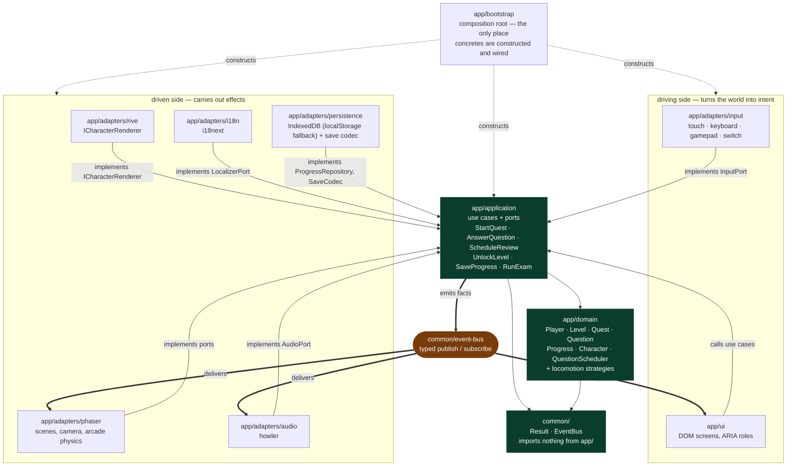
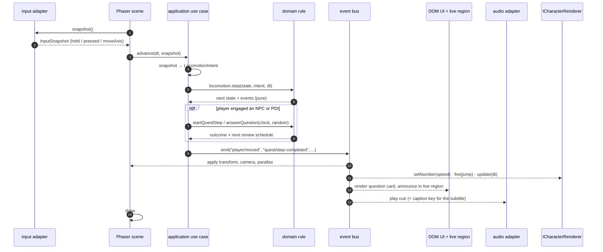
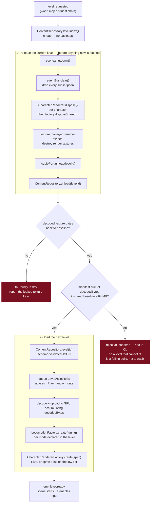
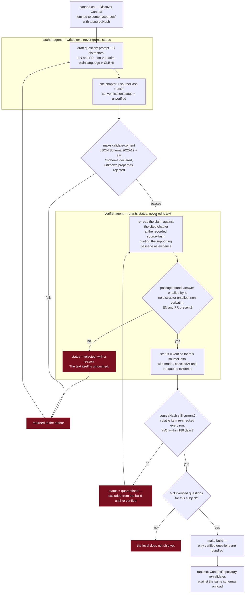

# TrueNorth — architecture

The shape of the system, and why it is that shape. Decisions live in `docs/adr/`; this file shows how
they fit together. If a diagram and an ADR disagree, the ADR wins and this file is the bug.

One sentence: **the engine changes more often than the rules, so the rules do not know the engine exists.**

Every boundary in this file is defended by something that fails a build, never by a convention: layering by
`.dependency-cruiser.cjs`, content shapes and value constraints by `make validate-content`, the agreement
between a schema and its port type — names, optionality *and* value types, branded ids included — by the
ADR-0007 contract test, unimplemented ports by the `PROVISIONAL` contract test, and dated commitments in
documents by the ADR-0009 obligation gate. If a rule here has no gate behind it, that is stated where the
rule is.

## 1. Layers

`app/domain` is entities and pure rules. `app/application` is use cases and ports — interfaces only.
`app/adapters/*` implement those ports, one technology per directory. `app/ui` is accessible DOM.
`app/bootstrap` is the only place a concrete is chosen. `common/` is a leaf both sides may use.

Imports point inward. Facts travel outward on the typed event bus. Nothing points sideways:
adapters never import each other, and the UI never imports an adapter.

`.dependency-cruiser.cjs` is this picture, written as twelve rules, run by `make lint`. Every rule carries a
`comment` saying which boundary it defends. A violation fails CI; there are no warnings. Ten rules constrain
what a layer may import; two, added by amendment to ADR-0005, constrain who may import *it* —
`app/adapters` and `app/ui` may take the id vocabulary from `app/domain/ids` and nothing else from the
domain, and an adapter may not import `app/application/use-cases`, because an adapter is driven and never
driving.

## 2. A frame

The scene owns rendering and nothing else. It samples intent, asks the application to advance the world,
and applies what comes back. The domain decides; the bus announces; the renderers react.

The DOM UI and the Phaser canvas receive the *same* facts. That is what keeps the live region honest:
if the canvas shows it, the announcement was published, so the live region has it too.

Three consequences worth stating plainly:

- The domain takes `Clock` and `RandomSource` as arguments. It never reads `Date.now()` or `Math.random()`,
  so an exam draw is replayable from its seed and a spaced-repetition test does not need to freeze time.
- `Locomotion.step` is pure. Adding canoe, skate, bike, train, horse, skateboard or dogsled is one strategy
  plus level JSON — the scene above does not change, because it never learns the mode.
- Nothing in this sequence is Phaser-specific except the two boxes labelled Phaser.

## 3. Level load and unload

The budget is the design driver: **≤ 64 MB decoded texture memory per level on iPhone, and the previous
level is released before the next one is loaded** (CLAUDE.md, Budgets). So unload is not cleanup after
the fact — it is a step the next load waits for.

The loader admits a level only if the manifest's declared `decodedBytes` fit the ceiling. That check is
static and runs in CI too, so a level that cannot fit is a failing build, not a crash on a phone.

**ADR-0013 is the decision behind this section** and should be read with it. Three things it settles that the
diagram cannot show: full-screen parallax layers ship at **1× only** (the same art at 2× puts Ottawa 46 % over
the global ceiling on payload of 0.19 MiB, so no download gate would ever have flinched); "full-screen" means
"the key appears in some level document's `layers[]`", not a pixel-area threshold; and the 64 MiB figure is a
**floor** on VRAM rather than a ceiling, because mipmaps, render targets and Rive's canvas surfaces are sized
by the display and not by a file, so no file-measuring gate can count them. The gap between 64 MiB and the
hardware limit is where those live.

The `+ shared baseline` term in the BUDGET node below is design intent that no gate implements yet — see
ADR-0013's open obligation.

`ContentRepository.unload`, `AudioPort.unload` and `CharacterRendererFactory.disposeShared` exist only
because of this diagram. They are on the ports so that no scene has to remember to call them.

## 4. Content pipeline

Facts are paraphrased from *Discover Canada* on canada.ca, chapter-referenced, and verified before they
ship (ADR-0003). The load-bearing rule is a **separation of duties**: the author writes the question and
may never set its verification status; the verifier grants or refuses status and may never edit the text.
A single agent doing both would be marking its own homework, and the status would mean nothing.

Status is granted against a `sourceHash`. If canada.ca changes, the hash changes, the status no longer
matches, and the question falls out of the build — automatically, without anyone noticing the edit.

The verifier writes five fields and only five (ADR-0003, mirrored by `FactVerification` in
`app/application/ports/content-repository.ts`): `status`, `model`, `checkedAt`, `sourceHash` and
`evidence`. `evidence` is the passage from the cited section quoted exactly, and it is the field that makes
ADR-0003's "the bank is auditable" consequence true — a `verified` status with no quoted passage is an
assertion, not an audit trail. An earlier draft of the port dropped it; nothing may drop it again, and since
slice 1 nothing can: `common.schema.json#/$defs/factVerification` carries a conditional requiring a non-empty
`evidence`, a non-empty `model`, a non-null `checkedAt` and a full `sourceHash` whenever `status` is
`verified`, so the claim fails `make validate-content` before `verify-content` is reached.

The pipeline below is drawn around a question because a question is the commonest case, but ADR-0003's
second amendment made the subject the **claim**, not the screen. A landmark blurb and a line of NPC dialogue
carry a `FactClaim` — `factual`, plus the same `source` and `verification` blocks — and travel the same
path. A wrong fact in a Mountie's mouth is exactly as wrong as one on a question card.

**A landmark may be any landmark; what it teaches is the guide's (ADR-0056).** A point of interest earns its
place by being the thing a player standing there expects to see, so *Discover Canada*'s silence about it is
no objection: measured on the tree, 3 of 35 display names appear in the guide at all, and two of those three
are picture captions. What the landmark **teaches** is guide material on exactly the terms a question is held
to — a cached source, a contiguous quote, a verifier's grant, ADR-0016's staleness clock — and there is no
second class of citable source. The seam between those two halves is the name: a blurb **may** name its own
landmark in prose even where the guide never prints that name, because a name points at an object the player
can see rather than asserting anything about Canada. The test is to strike the name out — if what remains is
still exactly what the cited passage says, it was a label; if striking it changes the claim, the guide has to
make that claim. A date, a height, a superlative or a founding attached to a landmark is a claim, however
iconic the landmark. None of this reaches a level's `territory` block, where ADR-0051's rule that a statement
names only what its source names stands untouched.

**Verification follows the claim; ownership follows the grade.** These are two rules, and they are easy to
merge by accident. Every claim, graded or told, is verified to the same standard (ADR-0003). Only a
*graded* proposition — the one a question's prompt asks and its `correctIndex` keys — belongs to a subject,
and at most one subject may grade it (ADR-0028), because the ship floor, the exam's by-subject rows and the
scheduler count graded propositions and nothing else. A blurb, a territorial statement, a line of dialogue
and a question's explanation are *told*: they may state a proposition another subject grades, and a level's
`subject` is the remit of its quest and its bank, not of every sentence drawn on the level (ADR-0030).
`a-proposition-belongs-to-one-subject.test.ts` holds the graded half; the told half has no ownership rule to
hold. One place in the code still disagrees: until ADR-0030's gate change lands, gate A4 binds every level
claim's grant to the level's `subject`.

**The level's subject reaches the draw (ADR-0036).** `SceneLevel` carries `subject`, which the scene never
reads and the composition root does: every question a level asks — at a landmark, or at a giver whose task
opens on an `answer` step — is drawn from that subject through `StudySession.drill(count, scope)`, and
`app/bootstrap/landmark-questions.ts` is the rule for how many and how the card counts them. A question
resting on the sentence the landmark just told (the same `source.quote`, normalised as the contract gate
does, in `app/application/content/proposition.ts`) is asked first. The end of a level earns its stamp only
when the task is done, the level sets none, or the stamp is already held (`app/domain/entities/level-end.ts`).

**One sentence, one fact (ADR-0052).** A stamp says "I went and did this" and never "I know this", so no
level has a pass mark and none can be failed; what a wrong answer costs is that the question comes back, and
the completion card counts those and offers a control to them. The rule that keeps the card honest binds a
**content** field: a quest's `doneLine` may describe where the player went, what the place was, and that the
errand is finished — and nothing about answering, because the two rows that count answers are recomputed on
every showing and a sentence authored months ago cannot be. It is held in two places and neither holds all of
it: a contract test over every `doneLine` in both languages catches the word families, and the card's own
structure keeps the counting rows apart from everything else. A warm sentence using none of those words still
passes, and that residual is named in the ADR rather than left to be inferred. Nothing in it reaches the
scheduler: a missed question already outranks the rest of the draw, so the card reports behaviour rather than
requesting it.

**A level asks only what it taught (ADR-0057).** Measured on 2026-09-17, the ten levels tell 88 distinct
propositions between them and their tasks ask 76 questions from pools naming 187 ids — 126 of which rest on a
sentence their level never says. The rule binds **content, at the `questionPool`**: an `answer` step may name
only questions whose `source.quote` shares a proposition with a granted `factClaim` that level tells, and a
claim told in quest dialogue must be told by an earlier step. No code and no schema moves, because the pool is
already the narrowing the draw applies — it is ADR-0048's stop rule reaching the task, where the pool was the
one exempt path. The deficit is closed by **teaching more, never by asking less**: a taught-only draw over
today's content leaves six of ten levels unable to fill their own task, which is ADR-0054's blocker. The extra
teaching is *Discover Canada*'s, surfaced rather than invented (ADR-0056 §2), so a level's teaching is bounded
by its subject's remit in the guide, which is finite. The remit itself does not move: ADR-0028's floor of
thirty stands, a subject grades more than any one level teaches, and the surplus is met in Study and the exam
— neither of which this rule reaches, because there the player is the one asking. A contract test can hold the
quote arithmetic and the step order; it cannot tell whether a true sentence teaches anything, and that
residual belongs to the author's brief rather than to a sixth verification check.

**The whole guide is readable by chapter, and a lesson passage tells one proposition (ADR-0061).** Measured
on 2026-09-18 against the cached extraction at the hash every claim is granted against, the guide is 18,372
words and the corpus's 602 claims cover 46.3% of them. The teachable remainder is about **5,446 words**,
concentrated in *Canada's History* (2,321) rather than in the North, and the short chapters are genuinely
exhausted — *Canada's Economy* has 61 uncited teachable words left and *The Justice System* 9. That remainder
does not fit on landmarks: a `pointOfInterest` carries exactly one `fact`, and every new stop is art, a
reference entry, a blind identification run and texture budget. It goes instead on a **Learn** surface beside
Study and Exam, organised by the guide's own chapters, where a chapter holds lessons and a lesson holds
**passages** — a passage being one bilingual paragraph carrying exactly one `factClaim`: one proposition, one
contiguous quote, one grant. The unit is a decision about verification rather than layout, because a grant
stretched over a chapter has no truth condition a verifier can check and would end the property that every
shipped claim carries the passage supporting it. Passages require a stable `id`: `scripts/lib/claims.mjs`
keys an array step by the item's `id` only when the schema requires one, so without it inserting a passage
re-points every pointer beneath it and voids every grant in the lesson. A lesson is a **told** claim carrying
a `chapter` and deliberately no `subject`, so it enters no floor, no exam row and no schedule (ADR-0030); the
thirty-question floor and the exam are untouched, and no level may ask anything on the strength of a lesson —
ADR-0057's programme runs beside this one and neither can do the other's job. Chapters are lazily imported
and cached on first read, so Learn works offline and stays out of the ≤ 8 MB initial payload, costing no
texture memory and nothing in any level's budget. "The whole guide" never means the guide's sentences: the
source is Crown copyright and `committed: false`, which is also why the coverage measurement cannot run in
CI — and picture captions, the study worksheet, the museum invitation, front and back matter and the Oath's
recitation are excluded from it by name.

Indigenous content passes `docs/content-review.md` as well: name the nation depicted, no invented patterns,
no sacred items as props, no caricature, identical cartoon proportions for every character.

### A level's art and its document land together

Found while building the second level, and recorded because it is the shape every level from here will have
and it contradicts a reasonable assumption.

`scripts/assets.mjs` refuses to guess which level a source file belongs to — `assets/src/svg/<levelId>/…`
resolves by the level id, and an unresolvable path is a hard failure rather than a warning. The level document
is what supplies that id, and the gate also checks that every key a document names is actually produced. So:

- a level document without its art names keys that resolve to nothing;
- art without its level document has an owner id that matches no level.

**Neither is valid alone, so they are not committable separately.** That is deliberate — it is what makes "a
level has to load from its JSON alone" checkable — but it means art and content cannot land independently for
a level, and a slice plan that plots them as separate tasks is plotting one commit as two.

### A quest giver is an engageable, and the level says what kind

A quest is offered by **something the player engages** — `CLAUDE.md`'s traversal rule already names both
kinds: *"tap NPC or POI to engage."* `quest.giver` and `dialogueLine.speaker` are therefore **unbranded ids**
naming either a character in the level's `characters[]` or a point of interest in its `pois[]`, the same
treatment `questStep.targetId` has had since it was written, for the same reason: a union of brands is not a
shape JSON Schema can state.

Both said `characterId` until ADR-0029, and that one word was a scope cut. `peggys-cove` and `the-north` may
draw no figure of any kind at any scale — a decision recorded in their art documents and their story
documents, and not one this architecture may weaken — so those two levels could hold no quest at all and
shipped with `quests: []` and `characters: []`. A plaque is not a figure, and it offers, reminds and closes
as well as a person does.

**The kind is not recorded on the quest.** It is resolved from the level, which is the document that owns
placement, and this is the general rule worth carrying: *when a reference may name entities from more than
one collection, the discriminator lives where the entity was placed, not on the thing pointing at it.* A
second declaration on the quest could disagree with the first, and neither would be wrong on its own.

What that costs is a cross-document check, and it is the interesting half:

> **Exactly one placement on the quest's level carries the id, and that placement declares `questId` back.**

Not `find`, not `some`, not `filter` — those reduce an empty collection to `undefined`, `false` or `[]`, and
two of the three read as an answer (ADR-0024 §1). *Exactly one* has no success-shaped identity element: zero
is a **dangling** giver, two is an **ambiguous** one, and the failure says which. The same pass forbids an
`expression` on a landmark speaker, because the level's placement is the smallest thing that knows whether a
speaker has a face (ADR-0024 §2).

It lives in `tests/unit/contracts/a-quest-giver-is-placed-on-its-level.test.ts` rather than in
`scripts/validate-content.mjs`, deliberately: this is a claim checked against another claim, two documents
that must agree, and it needs no corpus walk that could pass over nothing. Writing it closed two gaps that
were open and one that was worse than open — `quest.schema.json` had been *asserting* that
`validate-content` cross-checked a quest against its level's `quests[]`, and no such code had ever existed.

What the schema still cannot say, and review holds instead: a landmark's lines are written in the second
person and the impersonal. That is an accessibility rule rather than a style one — a screen-reader user gets
the dialog's accessible name and then the prose, so first-person prose after "Peggy's Point Lighthouse" has
told that user a person is standing there. `docs/guidelines/dialogue-quests-and-landmarks.md` carries it.

## 5. Ports

All under `app/application/ports/`, re-exported from `index.ts`. Interfaces and types only.

`PROVISIONAL` in the last column means nothing imports the port and nothing implements it: it is a design
sketch that happens to be type-checked, and the first implementer may change it without an ADR (ADR-0008).
The column is enforced, not maintained by hand — `tests/unit/contracts/ports-are-provisional.test.ts` fails
if a port is unconsumed and unmarked, and fails again if the marker outlives the first caller. **It also
reads this table**: a row whose State disagrees with its file's marker fails the same test, so the table
cannot drift out of step with the directory it describes. That drift had already happened once — four rows
here still read `PROVISIONAL` after their first callers landed in slice 1.

The gate reads import edges, so the finest thing it can see is a file. A *member* with no caller is
ADR-0015's subject and is found by review, not by CI; the reasoning for not building a member-level checker
is recorded there.

| Port | Hides | Notes | State |
|---|---|---|---|
| `ContentRepository` | fetch, ajv, caching | Async, `Result`-returning; `unload` serves the texture budget (ADR-0013) | Consumed |
| `ProgressRepository` | IndexedDB, `localStorage`, quota, private mode | `ok(null)` means "no save", not "storage failed" — and never means "the store would not answer" (ADR-0024, ADR-0026) | Consumed |
| `SaveCodec` | the export/import format | `decode` validates and migrates; never trusts its input. Save format **version 3**: 1 -> 2 landed with ADR-0026 and retired ADR-0015's tripwire, 2 -> 3 with ADR-0027, which made an exam attempt a record of the exam rather than a score line and gave the unfinished exam a field of its own | Consumed |
| `Clock` | `Date.now`, `performance.now` | `now()` for scheduling, `elapsed()` monotonic for timers. **No `nowIso()`** — ADR-0015 removed it; `toIsoInstant(clock.now())` is the one conversion | Consumed |
| `RandomSource` | `Math.random` | Seeded variant makes an exam draw replayable | Consumed |
| `Locomotion` | how a mode moves | Pure `step`; implementations live in the domain | Consumed |
| `ICharacterRenderer` | Rive vs. sprite atlas | Identical artboard, input, slot and expression names in both — and identical *structurally*: both backends answer `skinSlots`/`skinOptions` out of `CharacterRendererSpec.slots`, one array from one character document | Consumed by `app/adapters/rive` and `app/adapters/phaser/sprite-character-renderer.ts` (slice 1 task 1.12) |
| `AudioPort` | howler, autoplay unlock | Every cue carries a `captionKey` — sound always has a visual twin | `PROVISIONAL`, **no task** — delete it if slice 2 closes without an audio adapter |
| `LocalizerPort` | i18next | No literal player-facing string exists anywhere else | `PROVISIONAL` → slice 1 task 1.15 |
| `InputPort` | touch, keyboard, gamepad, switch | Keyboard bindings keyed by `KeyboardEvent.code` | `PROVISIONAL` → slice 1 task 1.15 |
| `MapAnchorsDocument` | the screen-art map's sidecar JSON | Where each level's stop sits in the drawing's own viewBox, plus the inset; carries no names. Mirrors `map-anchors.schema.json` (ADR-0007), and `make validate-content` cross-checks what the schema cannot: one anchor per level, every point inside the viewBox, every region id in the drawing | Consumed by `app/ui/level-map.ts` |
| `LevelArtCache` | Cache Storage, which files a level draws at this device's scale, and (as `Connectivity`) `navigator.onLine` | Answers which of a level's art files the browser cannot serve with no network. An error, never an empty list, when it cannot tell (ADR-0024). Offline and missing art means the level is not started; online it is never asked (ADR-0034, amended 2026-09-15) | Consumed by `app/application/use-cases/level-availability.ts`; implemented by `GameRenderer.missingLevelArt` |

### The character seam

ADR-0001 puts Rive behind `ICharacterRenderer` with a sprite-sheet fallback. The seam only works because
both backends speak the same four things: a **named artboard**, **state-machine inputs** (bool, number,
trigger), **skin slot names** with matching option names, and **named expressions**. The sprite adapter
derives its animation selection from exactly the inputs the Rive state machine consumes, and its atlas
frame prefixes *are* the slot names. Swapping backend is a bootstrap decision keyed on device tier, and
gameplay cannot tell which one it got.

### The locomotion seam

A level's JSON supplies a `LocomotionTuning` per mode, validated by
`level.schema.json#/$defs/locomotionTuning`: `maxSpeed`, `acceleration`, `deceleration`,
`turnAcceleration`, `glide` (how much momentum survives a release — near 1 on ice and water),
`maxSpeedMultiplierDownhill`, `drive` (`held` or `auto`), a `jump` affordance or `null` when the mode
cannot jump, an `interaction` affordance or `null` when the player must dismount first, the character
state-machine inputs the mode drives, and a `labelKey`.

Because every difference between walking and dogsledding is a number or a `null` in that record, adding a
mode is **data plus one pure strategy registered with `LocomotionFactory`**. No scene, camera or input
handler changes. An unregistered mode fails as `unsupported` at load time, not mid-level.

### The ride seam

What a mode puts under the player comes from one of two places, and the dividing line is **who pays for it**
(ADR-0031). Equipment small enough for the shared atlas — skates, a sled, a bicycle — is a `{mode}` brace on a
rig part and is charged to every level. Anything bigger — a passenger car, a horse — is a `ride` in the level
document, charged to that level alone: level art registered to its rider by a `riderAnchor` and a
`groundLineY`, drawn behind or in front of the rider's parts, optionally on its own repeating `track`, rocking
with speed and never under reduced motion.

A ride changes **where the rig is drawn, never where the player is**. The physics position, the camera, reach,
the auto-stop and the level exit all read the same `LocomotionState` they read before rides existed, and the
arithmetic is `app/adapters/phaser/ride.ts`, which imports no Phaser. No port was added: a ride is part of
`LevelDocument` and mirrored by `Ride` under ADR-0007, so the ports table below is unchanged.

### The creator preview seam

The character creator shows the player the character they are making, drawn with the level's own sprite
puppet (ADR-0040). The seam is **not an application port** and has no row in the table above: its first
argument is the DOM element to draw into, and a port may not name the DOM. `app/ui/character-creator.ts`
publishes `CreatorArtFactory` — a host element, and `draw`, `setMotion` and `destroy` — which is the same kind of
shape as the shell's `onPlayLevel`; `app/bootstrap/creator-art.ts` fills it and hands over the rig (ADR-0022);
`app/adapters/phaser/character-preview.ts` paints the puppet into a 2D canvas with no Phaser game behind it, so
the page never holds a second WebGL context. The atlas is the level's page, fetched when the creator opens and
released when it closes. The host reports `data-state` and `data-frames`, so a browser test reads what is drawn
without comparing pixels.

### Where an unaccepted character lives

The character a first-run player is shown before they have chosen anything is a **uniform draw**, never the
rig's `fallback` and never a house character (`docs/content-review.md` §8.1, §8.3). ADR-0053 decides where it
lives: **in `app/ui/shell.ts`, for the length of the sitting, and in no store at all.** The shell is built once
per boot and holds the draw across a language change, a Settings visit, Back and Play again, a level and an
exam — `clearView` destroys views, not the draw — and "Surprise me" is the only thing that replaces it.
Finishing the creator turns it into the save's `character`, which is the moment it becomes state; a reload
before that draws again, because a save with a character is not a first run (`TN-FIRSTRUN`, ruling 1) and
persisting a face nobody accepted would skip the creator. Nothing here is an exception to ADR-0026: there is
no second store, because there is nothing to store.

The composition root's half is the other side of the same line: `app/bootstrap` **repairs** a saved character
(`repairSelection`, `TN-LOOK-05`) and supplies the seeded `RandomSource`; it does not draw a character for a
save that has none, and the title screen's figure is painted from the save's character, so a face the player
has not chosen never appears on the screen before the creator. ADR-0053 carries that as a dated obligation —
today the draw is still made at boot, which is why the same responsibility can be read in two files.

### The screen art seam

The landmark card, the dialogue, the completion card, the title screen and the Study home draw pictures
(ADR-0041). Like the creator's, the seam is **not an application port**: a screen is handed a URL, or a
function that resolves to one, and draws it as decoration through `app/ui/screen-art.ts` — an `aria-hidden`
frame, an `alt=""` image, hidden when it cannot load. `app/bootstrap/screen-art.ts` decides what each URL is:
the level's own image for a point of interest's `artKey`, the level's hero landmark for its stamp, and faces
and the player's figure painted as stills by `app/adapters/phaser/character-still.ts`, which paints the level's
puppet into a canvas that never reaches the page and releases the decoded atlas before it returns. The title
and Study landscape is screen art under `assets/src/svg/screens/`, resolved through Vite like the map's
drawing. The three cards a level opens are sheets over it; the level behind is dimmed by a brightness filter on
the canvas, never by a wash over words.

### The letterbox seam

`Scale.FIT` on a fixed 1080 × 1920 canvas (ADR-0002) always leaves page showing: a band above and below it on
a phone taller than 9:16, and a panel down each side on a desktop window. Those are **CSS, not canvas** — zero
draw calls, zero overdraw, no texture — and the seam that makes them match the level runs one way only:
`app/adapters/phaser/level-scene.ts` reports *what the canvas draws*, `GameRenderer` publishes it as custom
properties, and `app/bootstrap` applies them to `:root`. The adapter never styles the page, and the scene never
learns that a panel exists. `sky-top.ts` is pure, so every case is a unit test rather than a screenshot taken
at the right hour.

Two decisions divide the work. **ADR-0044** owns the first row: the band above the canvas is painted with the
colour the canvas actually draws on row 0, and it is painted inside `#game`, so ADR-0041's dimming filter
reaches it. **ADR-0055** owns everything below that row: the side panels carry the level's **sky** as gradient
stops, down to the top of the level's second layer in depth order — **read from the level document**, so a
level moves its own boundary with no engine change — then a ramp through the mid-ground, then the flat land
band (ADR-0042). The mid-ground's mismatch is accepted there rather than owed: one colour per row cannot
describe a row with a skyline across it, and extending the real parallax layers into panels that are 1.846× the
canvas area is refused against the 4× overdraw ceiling. Both decisions are fed by **one** report, so the band
and the panels cannot drift.

## 6. Seams deliberately left open

Named here so a later slice picks them up on purpose rather than inventing them under pressure.

- **Event map.** `createEventBus` is generic over an event map; the game's actual map (`player/moved`,
  `quest/step-completed`, `question/answered`, `level/ready`) is declared in slice 1 with the use cases
  that emit it. Declaring names before there is a producer would be guessing.
- **Domain entities.** `app/domain/ids.ts` fixes the id vocabulary. `Player`, `Quest`, `Level`, `Question`,
  `Progress`, `Character` and `QuestionScheduler` belong to the domain agent in slice 1. The port document
  types (`LevelDocument`, `QuestionDocument`, …) are the *validated content shapes*, deliberately distinct
  from the entities built out of them — the content schemas remain the authority on the full shape
  (ADR-0007), which means a port type mirrors its schema exactly rather than declaring a subset.
- ~~**Content schemas not written yet.**~~ Closed by slice 1 task 1.2. `content/schemas/` holds nine files:
  `common`, `game.config`, `credits`, and the six the slice needed — `level`, `quest`, `question`,
  `character`, `locale`, `progress`. Every document type is reconciled against its schema, so no
  `SPECULATIVE` marker remains in `app/application/ports`, and the contract test now compares **value
  types** as well as property names, branded ids included (ADR-0007, third amendment).
- ~~**How a question carries its EN and FR text.**~~ Decided by **ADR-0010**: a content document carries its
  own text inline as `localizedText`, and a locale bundle carries engine and UI vocabulary reused across
  content. The dividing line is reuse, not screen. The one rule no gate expresses — a locale bundle may not
  state a fact about Canada, because that is the only place a `FactClaim` cannot reach it — is named in that
  ADR's consequences.
- ~~**`evidence` has no mechanical gate yet.**~~ It has two now: the conditional in
  `common.schema.json#/$defs/factVerification` described in §4, and task 1.17's `verify-content`.
- ~~**Four verification statuses in the port, three in ADR-0003.**~~ The schema keeps four and ADR-0003's
  second amendment names the fourth, so the ADR was widened deliberately rather than by a file it did not
  mention. `rejected` goes back to the author; `quarantined` goes back to the verifier.
- **The character vocabulary is declared twice.** `content/schemas/rig.schema.json` (ADR-0017) declares the
  slots, their options and the state-machine inputs for the shared rig; `character.schema.json` declares
  `slots[]` and `inputs[]` again, per character, with `kind` where the rig says `type`. **The rig owns the
  vocabulary and a character selects from it** — that direction is decided, and the edit that realises it is
  deliberately deferred until `content/characters/` holds a document to design against. Until then a
  character can name a slot option the rig has no frame for, and the failure is a part that silently draws
  nothing, which is indistinguishable from a deliberate "none".
- **Id constructors.** Ids are branded types with no parse functions yet; the content adapter casts once,
  immediately after schema validation. `parseLevelId`-style validators land with the entities. The brands
  themselves are now load-bearing at the schema boundary: `common.schema.json` declares a `$def` per id and
  the contract test demands the matching brand on every property that `$ref`s one, in both directions.
- **What decides which questions a quest asks.** Settled in `quest.schema.json` and worth stating here
  because it is a split of authority, not a field: an `answer` step declares `subject` and `count`, and may
  narrow the draw with an optional `questionPool`. The quest says *how many* and *from where*; the FSRS
  scheduler in the domain says *which*, from the player's own review state. A quest naming the ids outright
  would make the scheduler decorative; a scheduler ignoring the quest would make the step unbounded.
- **Device tiers.** Which tier gets Rive and which gets the sprite atlas is a bootstrap policy; the
  detection rule is not written yet, and no port needs to know it.
- **Save migration.** `SaveCodec` declares `version` and `minSupportedVersion`. The first migration is
  written when there is a second version — not before.
- **Ports not yet needed.** No telemetry port and no network port exist, because there is no server, no
  account and no analytics (CLAUDE.md, Storage). If one is ever proposed, it needs an ADR, not a file.
- **The update notice (ADR-0034).** The service worker is outside these layers entirely: `scripts/lib/pwa.mjs`
  builds it from `infra/pages/service-worker.js`, and the build writes its registration into `dist/index.html`.
  No port exists for it and none is needed, because `app/` never asks it anything. The one seam `app/` has is
  the browser's own: a page that was **already controlled when it loaded** and then hears `controllerchange` on
  `navigator.serviceWorker` is running older code than the worker now in charge, and should offer "A new version
  is ready" with a Reload button. Listening is a bootstrap concern, because it touches `navigator`; the notice
  is `app/ui` DOM and copy. Not built yet — ADR-0034 carries it as a dated obligation. If `app/bootstrap` later
  takes over registration as well, the build stops writing the inline script in the same change.
