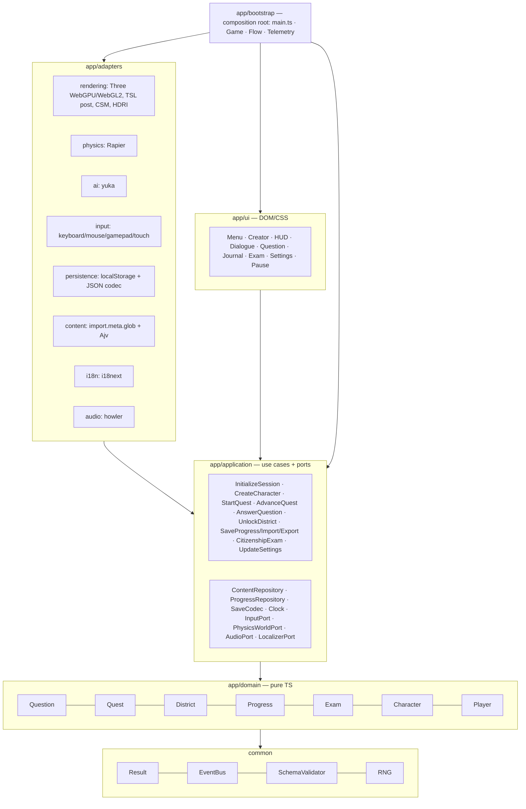
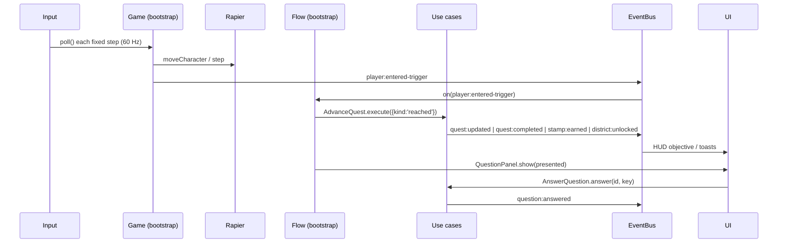
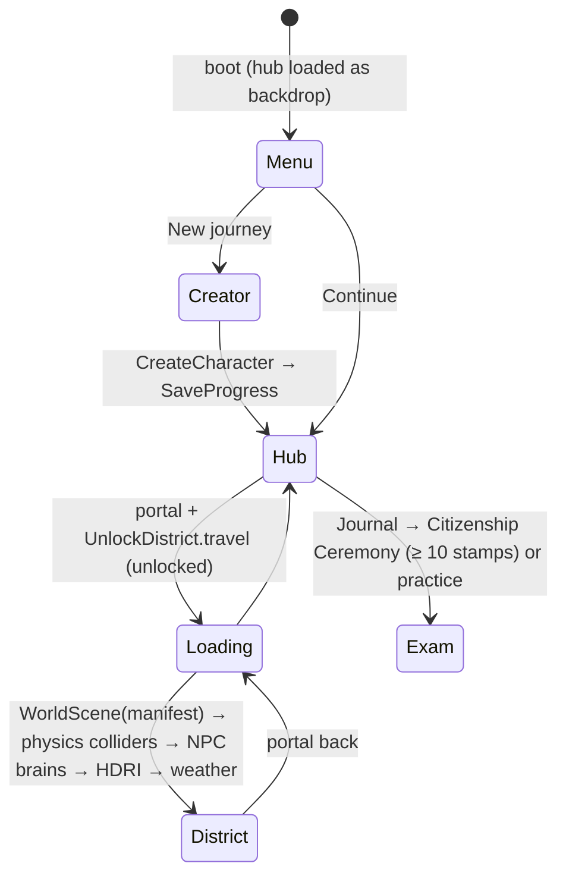
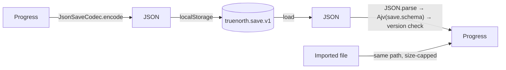
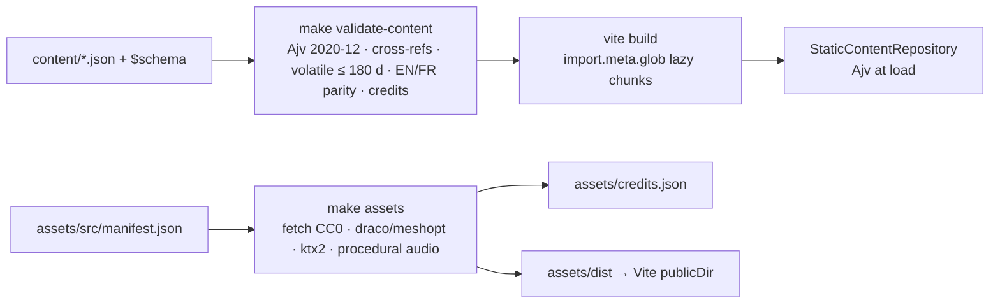

# Architecture

TrueNorth is a single domain-centric repository (BusinessRepo). See ADR-0001..0006 in `docs/adr/`.

## Layers

Rules are enforced by dependency-cruiser in `make lint`.

## Runtime systems and the event bus

## Scene streaming

Only one district is resident at a time. `WorldScene.dispose()` frees geometry, BVH trees and instanced meshes; `PhysicsWorldPort.clearStatic()` drops its colliders.

## Save / load

## Content pipeline

